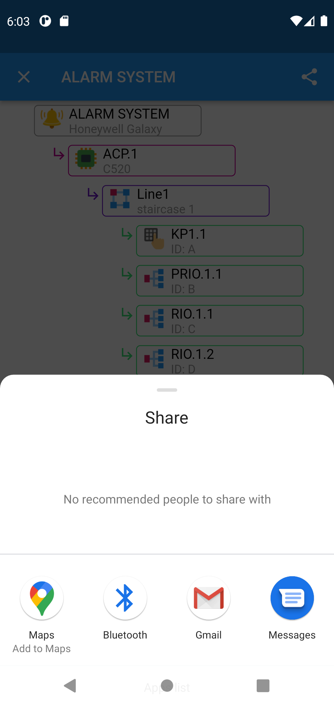

# ssia_app - Security Systems Installer Assistant

Mobile application for security system installers.
Supports work with addressable devices.
Allows you to create a visual tree of security systems.  

Application launched and tested on Android.

This is my first mobile app in Flutter, written to support my daily work.

## Features

- Create project (the name of the office building)
- Create project node (the name of the security system)
- Create node at any level (element of the security system)
- Edit / delete project or node
- Reorder project or node in list
- Import / export project to JSON file
- Graphical preview of the system structure
- Share system structure as image

## Screenshots

## Technologies

- Dart
- Flutter

## Setup

Clone this repo to your desktop and run `flutter pub get` to install all the packages.

## Launch

Run app using `flutter run` at the command line, or by using Run and Debug options in your IDE.  
You can also build app and install on your phone using Flutter documentation:  
https://docs.flutter.dev/deployment/android#building-the-app-for-release

## Inspiration

This app was based on Island Coder876 tutorial:  
*How to implement Domain Driven Design in Flutter Applications*  
https://www.youtube.com/playlist?list=PLFhJomvoCKC_YMx_ObwZG3bfImpu2VdEN

